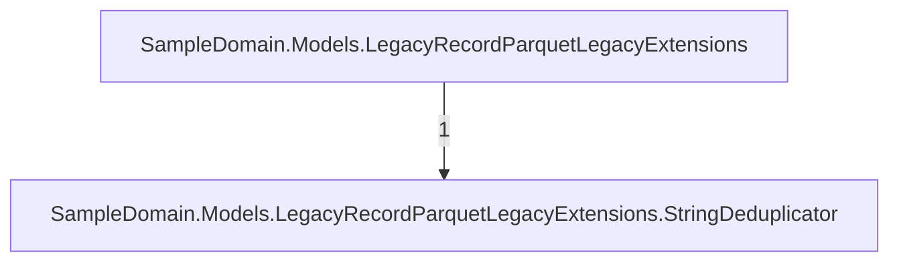
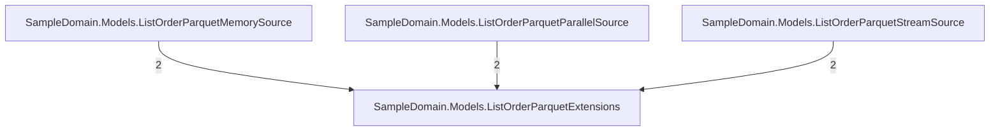
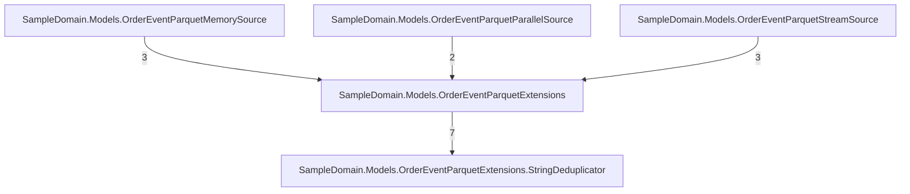
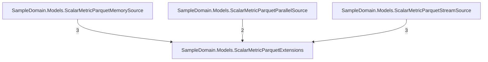

# The generated code's call graph — documentation (#252)

Static view of the golden models' emitted code: what a consumer's debugger walks.
Same extractor, same limits (delegates/virtuals invisible). Not a gate — the golden
files themselves are the contract; this page is the map. Refresh alongside the
call-graph baselines: `UPDATE_GOLDEN_FILES=true dotnet run scripts/CallGraph.cs`.

## LegacyRecordParquetLegacyExtensions.g

## ListOrderParquetExtensions.g

## NestedOrderParquetExtensions.g

## OrderEventParquetExtensions.g

## PocoOrderParquetExtensions.g

## ScalarMetricParquetExtensions.g

