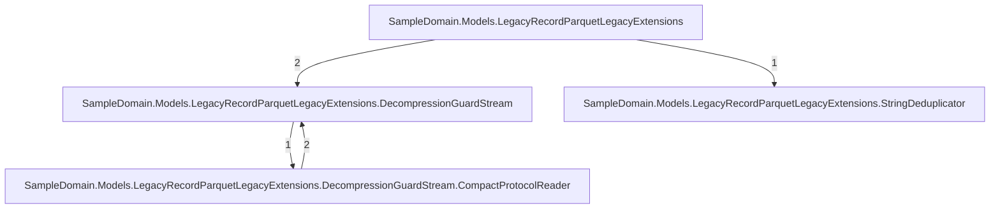
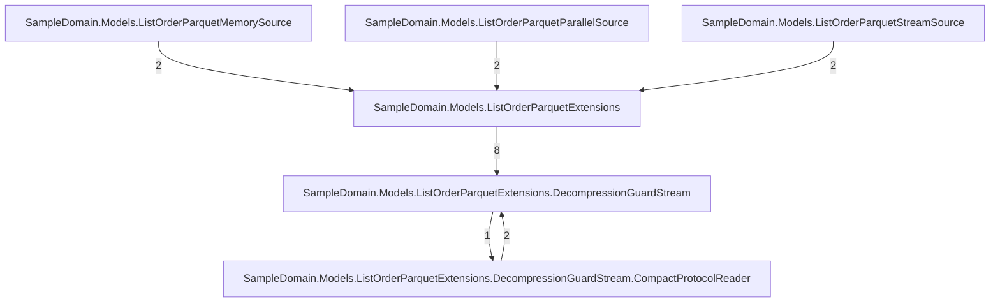
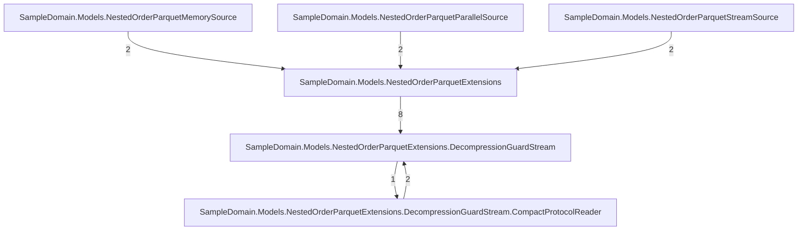
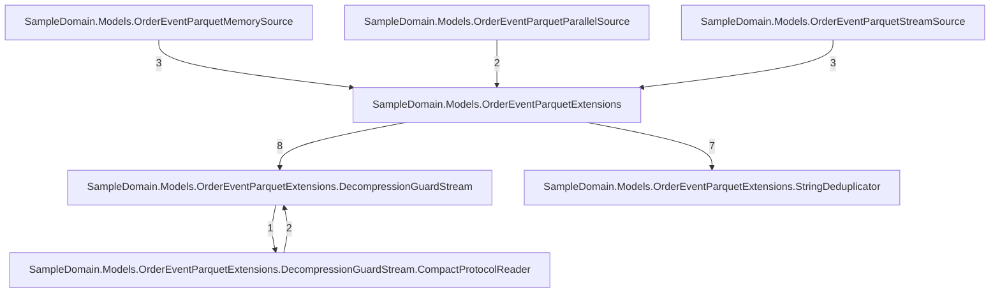
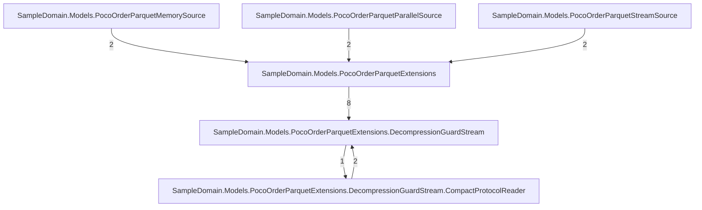
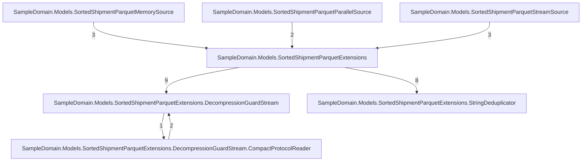

# The generated code's call graph — documentation (#252)

Static view of the golden models' emitted code: what a consumer's debugger walks.
Same extractor, same limits (delegates/virtuals invisible). Not a gate — the golden
files themselves are the contract; this page is the map. Refresh alongside the
call-graph baselines: `UPDATE_GOLDEN_FILES=true dotnet run scripts/CallGraph.cs`.

## LegacyRecordParquetLegacyExtensions.g



## ListOrderParquetExtensions.g



## NestedOrderParquetExtensions.g



## OrderEventParquetExtensions.g



## PocoOrderParquetExtensions.g



## ScalarMetricParquetExtensions.g

```mermaid
graph TD
    tsampledomainmodelsscalarmetricparquetextensions_049["SampleDomain.Models.ScalarMetricParquetExtensions"]
    tsampledomainmodelsscalarmetricparquetextensionsdecompressionguardstream_074["SampleDomain.Models.ScalarMetricParquetExtensions.DecompressionGuardStream"]
    tsampledomainmodelsscalarmetricparquetextensionsdecompressionguardstreamcompactprotocolreader_096["SampleDomain.Models.ScalarMetricParquetExtensions.DecompressionGuardStream.CompactProtocolReader"]
    tsampledomainmodelsscalarmetricparquetmemorysource_051["SampleDomain.Models.ScalarMetricParquetMemorySource"]
    tsampledomainmodelsscalarmetricparquetparallelsource_053["SampleDomain.Models.ScalarMetricParquetParallelSource"]
    tsampledomainmodelsscalarmetricparquetstreamsource_051["SampleDomain.Models.ScalarMetricParquetStreamSource"]
    tsampledomainmodelsscalarmetricparquetextensionsdecompressionguardstreamcompactprotocolreader_096 -->|2| tsampledomainmodelsscalarmetricparquetextensionsdecompressionguardstream_074
    tsampledomainmodelsscalarmetricparquetextensionsdecompressionguardstream_074 -->|1| tsampledomainmodelsscalarmetricparquetextensionsdecompressionguardstreamcompactprotocolreader_096
    tsampledomainmodelsscalarmetricparquetextensions_049 -->|8| tsampledomainmodelsscalarmetricparquetextensionsdecompressionguardstream_074
    tsampledomainmodelsscalarmetricparquetmemorysource_051 -->|3| tsampledomainmodelsscalarmetricparquetextensions_049
    tsampledomainmodelsscalarmetricparquetparallelsource_053 -->|2| tsampledomainmodelsscalarmetricparquetextensions_049
    tsampledomainmodelsscalarmetricparquetstreamsource_051 -->|3| tsampledomainmodelsscalarmetricparquetextensions_049
```

## SortedShipmentParquetExtensions.g



