# Call Graph — the shape #252 makes visible

<!-- Generated by scripts/CallGraph.cs. Refresh it with the same command as the
     baselines: UPDATE_GOLDEN_FILES=true dotnet run scripts/CallGraph.cs -->

Type-level view of the main generator (edges aggregated between types; numbers are
statically-resolvable call sites; delegates and virtual dispatch are invisible to it —
see docs/25-CALL-GRAPH.md). Full method-level edges: `graph/Parquet.SourceGenerator.callgraph.txt`.

```mermaid
graph TD
    tparquetsourcegeneratoremitterarrowbridgeemitter_050["Parquet.SourceGenerator.Emitter.ArrowBridgeEmitter"]
    tparquetsourcegeneratoremittercodeemitter_043["Parquet.SourceGenerator.Emitter.CodeEmitter"]
    tparquetsourcegeneratoremittercolumnbatchcomponent_052["Parquet.SourceGenerator.Emitter.ColumnBatchComponent"]
    tparquetsourcegeneratoremittercolumnarcolumnarbatchcomponent_063["Parquet.SourceGenerator.Emitter.Columnar.ColumnarBatchComponent"]
    tparquetsourcegeneratoremittercomponentsarrowmappingcomponent_064["Parquet.SourceGenerator.Emitter.Components.ArrowMappingComponent"]
    tparquetsourcegeneratoremittercomponentsbatchvalidationcomponent_067["Parquet.SourceGenerator.Emitter.Components.BatchValidationComponent"]
    tparquetsourcegeneratoremittercomponentsbufferpoolcomponent_062["Parquet.SourceGenerator.Emitter.Components.BufferPoolComponent"]
    tparquetsourcegeneratoremittercomponentspropertymappingcomponent_067["Parquet.SourceGenerator.Emitter.Components.PropertyMappingComponent"]
    tparquetsourcegeneratoremittercomponentsrowgrouplayoutcomponent_066["Parquet.SourceGenerator.Emitter.Components.RowGroupLayoutComponent"]
    tparquetsourcegeneratoremittercomponentsschemacomponent_058["Parquet.SourceGenerator.Emitter.Components.SchemaComponent"]
    tparquetsourcegeneratoremittercomponentsstringdeduplicatorcomponent_070["Parquet.SourceGenerator.Emitter.Components.StringDeduplicatorComponent"]
    tparquetsourcegeneratoremittercompoundcompoundbuffers_056["Parquet.SourceGenerator.Emitter.Compound.CompoundBuffers"]
    tparquetsourcegeneratoremittercompoundcompoundmapping_056["Parquet.SourceGenerator.Emitter.Compound.CompoundMapping"]
    tparquetsourcegeneratoremittercompoundcompoundschema_055["Parquet.SourceGenerator.Emitter.Compound.CompoundSchema"]
    tparquetsourcegeneratoremittercompoundemissionplan_053["Parquet.SourceGenerator.Emitter.Compound.EmissionPlan"]
    tparquetsourcegeneratoremitterreadbuildercomponent_052["Parquet.SourceGenerator.Emitter.ReadBuilderComponent"]
    tparquetsourcegeneratoremitterrowgrouppruningcomponent_056["Parquet.SourceGenerator.Emitter.RowGroupPruningComponent"]
    tparquetsourcegeneratoremittersortedrowgrouppruningcomponent_062["Parquet.SourceGenerator.Emitter.SortedRowGroupPruningComponent"]
    tparquetsourcegeneratormodelssortkeyeligibility_049["Parquet.SourceGenerator.Models.SortKeyEligibility"]
    tparquetsourcegeneratorparquetincrementalgenerator_051["Parquet.SourceGenerator.ParquetIncrementalGenerator"]
    tparquetsourcegeneratorparsertargetparser_043["Parquet.SourceGenerator.Parser.TargetParser"]
    tparquetsourcegeneratoremitterarrowbridgeemitter_050 -->|4| tparquetsourcegeneratoremittercomponentsarrowmappingcomponent_064
    tparquetsourcegeneratoremittercodeemitter_043 -->|2| tparquetsourcegeneratoremittercolumnbatchcomponent_052
    tparquetsourcegeneratoremittercodeemitter_043 -->|3| tparquetsourcegeneratoremittercolumnarcolumnarbatchcomponent_063
    tparquetsourcegeneratoremittercodeemitter_043 -->|1| tparquetsourcegeneratoremittercomponentsbatchvalidationcomponent_067
    tparquetsourcegeneratoremittercodeemitter_043 -->|11| tparquetsourcegeneratoremittercomponentsbufferpoolcomponent_062
    tparquetsourcegeneratoremittercodeemitter_043 -->|6| tparquetsourcegeneratoremittercomponentspropertymappingcomponent_067
    tparquetsourcegeneratoremittercodeemitter_043 -->|1| tparquetsourcegeneratoremittercomponentsrowgrouplayoutcomponent_066
    tparquetsourcegeneratoremittercodeemitter_043 -->|4| tparquetsourcegeneratoremittercomponentsschemacomponent_058
    tparquetsourcegeneratoremittercodeemitter_043 -->|3| tparquetsourcegeneratoremittercomponentsstringdeduplicatorcomponent_070
    tparquetsourcegeneratoremittercodeemitter_043 -->|3| tparquetsourcegeneratoremittercompoundcompoundbuffers_056
    tparquetsourcegeneratoremittercodeemitter_043 -->|10| tparquetsourcegeneratoremittercompoundcompoundmapping_056
    tparquetsourcegeneratoremittercodeemitter_043 -->|2| tparquetsourcegeneratoremittercompoundcompoundschema_055
    tparquetsourcegeneratoremittercodeemitter_043 -->|20| tparquetsourcegeneratoremittercompoundemissionplan_053
    tparquetsourcegeneratoremittercodeemitter_043 -->|1| tparquetsourcegeneratoremitterreadbuildercomponent_052
    tparquetsourcegeneratoremittercodeemitter_043 -->|12| tparquetsourcegeneratoremitterrowgrouppruningcomponent_056
    tparquetsourcegeneratoremittercodeemitter_043 -->|3| tparquetsourcegeneratoremittersortedrowgrouppruningcomponent_062
    tparquetsourcegeneratoremittercolumnbatchcomponent_052 -->|1| tparquetsourcegeneratoremittercodeemitter_043
    tparquetsourcegeneratoremittercolumnbatchcomponent_052 -->|1| tparquetsourcegeneratoremittercomponentsbufferpoolcomponent_062
    tparquetsourcegeneratoremittercolumnbatchcomponent_052 -->|3| tparquetsourcegeneratoremittercompoundemissionplan_053
    tparquetsourcegeneratoremittercolumnarcolumnarbatchcomponent_063 -->|9| tparquetsourcegeneratoremittercomponentsbufferpoolcomponent_062
    tparquetsourcegeneratoremittercolumnarcolumnarbatchcomponent_063 -->|1| tparquetsourcegeneratoremittercompoundemissionplan_053
    tparquetsourcegeneratoremittercompoundcompoundbuffers_056 -->|14| tparquetsourcegeneratoremittercomponentsbufferpoolcomponent_062
    tparquetsourcegeneratoremittercompoundcompoundbuffers_056 -->|4| tparquetsourcegeneratoremittercompoundemissionplan_053
    tparquetsourcegeneratoremittercompoundcompoundmapping_056 -->|2| tparquetsourcegeneratoremittercomponentspropertymappingcomponent_067
    tparquetsourcegeneratoremittercompoundcompoundmapping_056 -->|3| tparquetsourcegeneratoremittercompoundemissionplan_053
    tparquetsourcegeneratoremittercompoundcompoundschema_055 -->|1| tparquetsourcegeneratoremittercomponentsschemacomponent_058
    tparquetsourcegeneratoremittercompoundcompoundschema_055 -->|1| tparquetsourcegeneratoremittercompoundemissionplan_053
    tparquetsourcegeneratoremitterreadbuildercomponent_052 -->|1| tparquetsourcegeneratoremittercolumnbatchcomponent_052
    tparquetsourcegeneratoremitterreadbuildercomponent_052 -->|3| tparquetsourcegeneratoremitterrowgrouppruningcomponent_056
    tparquetsourcegeneratoremitterrowgrouppruningcomponent_056 -->|1| tparquetsourcegeneratoremittercompoundemissionplan_053
    tparquetsourcegeneratoremittersortedrowgrouppruningcomponent_062 -->|1| tparquetsourcegeneratoremittercompoundemissionplan_053
    tparquetsourcegeneratoremittersortedrowgrouppruningcomponent_062 -->|1| tparquetsourcegeneratormodelssortkeyeligibility_049
    tparquetsourcegeneratorparquetincrementalgenerator_051 -->|2| tparquetsourcegeneratoremitterarrowbridgeemitter_050
    tparquetsourcegeneratorparquetincrementalgenerator_051 -->|1| tparquetsourcegeneratoremittercodeemitter_043
    tparquetsourcegeneratorparquetincrementalgenerator_051 -->|1| tparquetsourcegeneratorparsertargetparser_043
    tparquetsourcegeneratorparsertargetparser_043 -->|1| tparquetsourcegeneratormodelssortkeyeligibility_049
```

